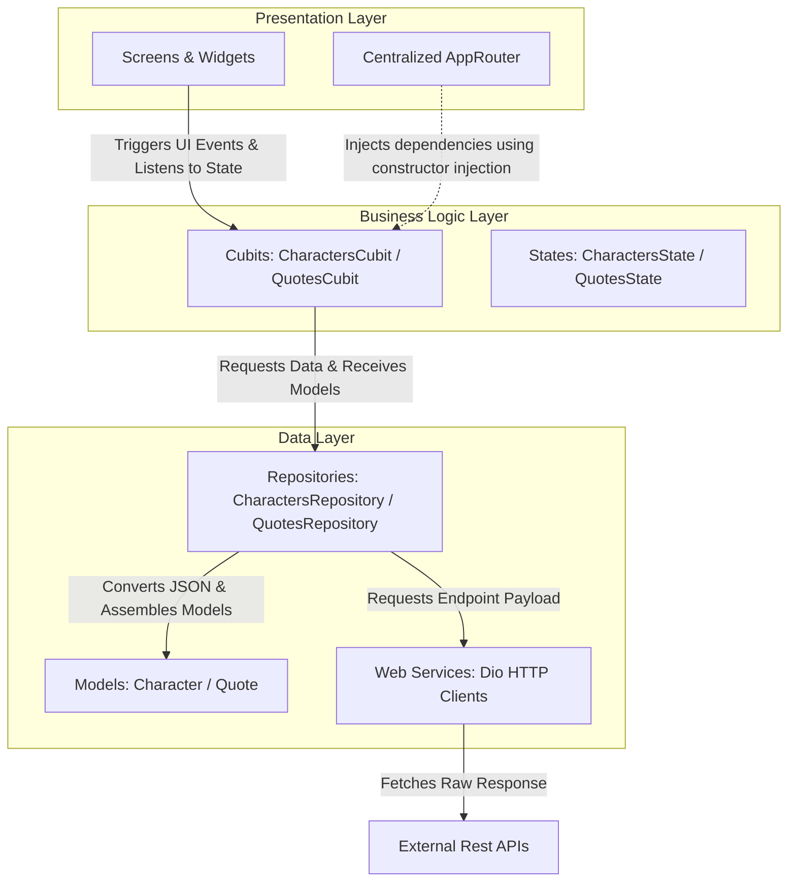

# Flutter BLoC Mastery - Course Study & Project Repository 🚀

This repository contains the source code and documentation of the project built during my study of the **"Flutter BLoC Mastery (بالعربي)"** series by Omar Ahmed.

The project is a real-world, high-performance Flutter application displaying characters from the **Rick and Morty** universe (fetched from the [Rick and Morty API](https://rickandmortyapi.com/)), alongside randomly animated quotes from the **Breaking Bad** universe (fetched from the [Breaking Bad Quotes API](https://api.breakingbadquotes.xyz/)). It implements a highly modular, clean architecture with BLoC/Cubit state management.

---

## 📱 App Features & Highlights

The application is built to demonstrate production-grade coding practices beyond just basic state management:

* **State Management via Cubits:** Leveraging lightweight [Cubit](https://pub.dev/packages/bloc) classes to manage screen states (Loading, Loaded, Error) instead of full heavy BLoC patterns where unnecessary.
  * [CharactersCubit](file:///d:/projects/flutter-projects/flutter_bloc_course/lib/business_logic/cubit/characters_cubit.dart#L10) fetches and manages the state of the characters list.
  * [QuotesCubit](file:///d:/projects/flutter-projects/flutter_bloc_course/lib/business_logic/cubit/quotes_cubit.dart#L10) manages the state of random quotes.
* **Local Search & Filtering:** Quick local list filtering in the search bar without triggering unnecessary BLoC states or API calls, handled efficiently via `onChanged` and `setState` inside [CharactersScreen](file:///d:/projects/flutter-projects/flutter_bloc_course/lib/presentation/screens/characters_screen.dart#L9).
* **Slivers & CustomScrollView:** Advanced scroll animations on the details screen using `SliverAppBar` and `CustomScrollView` in [CharacterDetailsScreen](file:///d:/projects/flutter-projects/flutter_bloc_course/lib/presentation/screens/character_details_screen.dart#L11).
* **Hero Animations:** Seamless, fluid image transitions when switching from the home grid to the character details screen, using matching `Hero` tags in [CharacterItem](file:///d:/projects/flutter-projects/flutter_bloc_course/lib/presentation/widgets/character_item.dart#L8) and [CharacterDetailsScreen](file:///d:/projects/flutter-projects/flutter_bloc_course/lib/presentation/screens/character_details_screen.dart#L11).
* **Random Animated Quotes:** Integration of a secondary Cubit that fetches quotes from an external endpoint and animates them dynamically on the screen using `FlickerAnimatedText` from the `animated_text_kit` library in [CharacterDetailsScreen](file:///d:/projects/flutter-projects/flutter_bloc_course/lib/presentation/screens/character_details_screen.dart#L11).
* **Real-time Offline Handling:** Instantly detects when the internet connection drops and swaps the entire UI with a clean "No Internet" screen, restoring the previous view automatically when the network is re-established (without restarting the app), utilizing the `flutter_offline` package's `OfflineBuilder` in [CharactersScreen](file:///d:/projects/flutter-projects/flutter_bloc_course/lib/presentation/screens/characters_screen.dart#L9).

---

## 🏗️ Clean Architecture & Clean Code Design

This project is built from the ground up adhering to **Clean Architecture** principles and **Clean Code** standards, ensuring modularity, scalability, testability, and a clear separation of concerns.

### 📐 Structural Flow & Layer Interactions
The architecture consists of three decoupled layers that communicate unidirectionally:



### 💎 Clean Code Principles Implemented

1. **Separation of Concerns (SoC):** 
   The presentation layer is purely declarative. Widgets only render states and emit UI interactions, keeping them clean and decoupled from business logic and database/API requests.
2. **Single Responsibility Principle (SRP):**
   * **Web Services Layer** ([lib/data/web_services](file:///d:/projects/flutter-projects/flutter_bloc_course/lib/data/web_services)): Dedicated to calling external REST endpoints and handling raw networking payloads.
   * **Models Layer** ([lib/data/models](file:///d:/projects/flutter-projects/flutter_bloc_course/lib/data/models)): Encapsulates JSON serialization and deserialization, converting raw JSON lists into safe, immutable Dart models.
   * **Repository Layer** ([lib/data/repository](file:///d:/projects/flutter-projects/flutter_bloc_course/lib/data/repository)): Acts as the single source of truth for the business logic layer, mediating between remote services and mapping raw payloads to UI-ready domain objects.
   * **Business Logic Layer** ([lib/business_logic](file:///d:/projects/flutter-projects/flutter_bloc_course/lib/business_logic)): Receives clean models and handles how state transitions happen under the hood, completely oblivious of which networking package or external endpoint was utilized.
3. **Dependency Injection & Constructor Injection:**
   Rather than instantiating classes directly inside the widgets or repositories, dependencies are passed dynamically via constructors (e.g., in [AppRouter](file:///d:/projects/flutter-projects/flutter_bloc_course/lib/app_router.dart#L23-L29)). This promotes loose coupling and makes unit testing individual units straightforward.
4. **Strong Typing & Null Safety:**
   Avoiding the usage of untyped dynamic values in the UI layer. Every parameter, function return, and data field is explicitly typed to prevent runtime null pointer exceptions.
5. **Centralized Declarative Routing:**
   Routes and dependency wiring are isolated in a single component, [AppRouter](file:///d:/projects/flutter-projects/flutter_bloc_course/lib/app_router.dart#L14). This prevents scattering `Navigator` configurations and manually creating provider dependencies inside screen widgets.

---

## 📂 Detailed Layer Architecture

### 1. Data Layer ([lib/data](file:///d:/projects/flutter-projects/flutter_bloc_course/lib/data))
* **Web Services (Dio):** Handles external HTTP REST requests, base configurations, and response timeouts.
  * [CharactersWebServices](file:///d:/projects/flutter-projects/flutter_bloc_course/lib/data/web_services/characters_web_services.dart#L5) handles connections to the Rick and Morty characters endpoint.
  * [QuotesWebService](file:///d:/projects/flutter-projects/flutter_bloc_course/lib/data/web_services/quotes_web_service.dart#L4) handles connections to the Breaking Bad quotes endpoint.
* **Models:** Built-safe Dart objects mapped from raw JSON responses (includes `fromJson` mapping logic).
  * [Character](file:///d:/projects/flutter-projects/flutter_bloc_course/lib/data/models/characters.dart#L1) maps character details.
  * [Quote](file:///d:/projects/flutter-projects/flutter_bloc_course/lib/data/models/quotes.dart#L1) maps quote details.
* **Repository:** Serves as the single source of truth for the Business Logic Layer. It processes raw API models and serves them formatted to the Cubits.
  * [CharactersRepository](file:///d:/projects/flutter-projects/flutter_bloc_course/lib/data/repository/characters_repository.dart#L5) processes character lists.
  * [QuotesRepository](file:///d:/projects/flutter-projects/flutter_bloc_course/lib/data/repository/quotes_repository.dart#L5) processes quote lists.

### 2. Business Logic Layer ([lib/business_logic](file:///d:/projects/flutter-projects/flutter_bloc_course/lib/business_logic))
* **Cubits & States:** Emits distinct states to the UI based on repository responses.
  * [CharactersCubit](file:///d:/projects/flutter-projects/flutter_bloc_course/lib/business_logic/cubit/characters_cubit.dart#L10) & [CharactersState](file:///d:/projects/flutter-projects/flutter_bloc_course/lib/business_logic/cubit/characters_state.dart#L8) manage character loaded/loading states.
  * [QuotesCubit](file:///d:/projects/flutter-projects/flutter_bloc_course/lib/business_logic/cubit/quotes_cubit.dart#L10) & [QuotesState](file:///d:/projects/flutter-projects/flutter_bloc_course/lib/business_logic/cubit/quotes_state.dart#L8) manage quote loaded/loading states.

### 3. Presentation Layer ([lib/presentation](file:///d:/projects/flutter-projects/flutter_bloc_course/lib/presentation))
* **App Router:** A centralized on-the-fly route generator for seamless screen navigation.
  * [AppRouter](file:///d:/projects/flutter-projects/flutter_bloc_course/lib/app_router.dart#L14) configures and supplies the required BLoCs down the widget tree using `BlocProvider`.
* **Screens:**
  * [CharactersScreen](file:///d:/projects/flutter-projects/flutter_bloc_course/lib/presentation/screens/characters_screen.dart#L9) displays a grid of character cards with local search capabilities and offline handling.
  * [CharacterDetailsScreen](file:///d:/projects/flutter-projects/flutter_bloc_course/lib/presentation/screens/character_details_screen.dart#L11) displays character details (Gender, Status, Locations, Episodes) and animated quotes.
* **Widgets:**
  * [CharacterItem](file:///d:/projects/flutter-projects/flutter_bloc_course/lib/presentation/widgets/character_item.dart#L8) defines individual modular UI grid tiles with FadeInImage network loaders and Hero widgets.

---

## 📂 Project Structure

```text
lib/
├── business_logic/
│   └── cubit/
│       ├── characters_cubit.dart
│       ├── characters_state.dart
│       ├── quotes_cubit.dart
│       └── quotes_state.dart
├── constants/
│   ├── my_colors.dart
│   └── strings.dart
├── data/
│   ├── models/
│   │   ├── characters.dart
│   │   └── quotes.dart
│   ├── repository/
│   │   ├── characters_repository.dart
│   │   └── quotes_repository.dart
│   └── web_services/
│       ├── characters_web_services.dart
│       └── quotes_web_service.dart
├── presentation/
│   ├── screens/
│   │   ├── character_details_screen.dart
│   │   └── characters_screen.dart
│   └── widgets/
│       └── character_item.dart
├── app_router.dart
└── main.dart
```

---

## 🛠️ Main Tools & Dependencies Used

* **[flutter_bloc](https://pub.dev/packages/flutter_bloc) & [bloc](https://pub.dev/packages/bloc) (^9.1.1):** Primary state management library.
* **[dio](https://pub.dev/packages/dio) (^5.10.0):** Advanced, feature-rich HTTP client.
* **[flutter_offline](https://pub.dev/packages/flutter_offline) (^6.0.0):** Live listener for network connection changes.
* **[animated_text_kit](https://pub.dev/packages/animated_text_kit) (^4.3.0):** A collection of cool and beautiful text animations.
* **Postman:** Used extensively during development to analyze and verify the API responses before mapping models.

---

## 📝 Course Syllabus Study Map

Below is a detailed tracker of the curriculum covered in this project:

| Ep. | Title & Content Summary | Key Achievements & Focus | Key Code Files |
| :---: | :--- | :--- | :--- |
| **#0** | Introduction | Understood the app scope, inspected features (Search, Hero transitions, Offline states). | [main.dart](file:///d:/projects/flutter-projects/flutter_bloc_course/lib/main.dart) |
| **#1** | Why? How? | Explored clean separation of UI, Business Logic, and Data. Understood Streams. | - |
| **#2** | Concepts | Deep dive into BLoC vs Cubit. Mastered BlocProvider, BlocBuilder, and BlocConsumer. | - |
| **#3** | Project Setup | Layered folder architecture, API evaluation using Postman, dependency installation. | [pubspec.yaml](file:///d:/projects/flutter-projects/flutter_bloc_course/pubspec.yaml) |
| **#4** | Model & Navigation | Created JSON-to-Dart Models. Implemented centralized routing using AppRouter. | [characters.dart](file:///d:/projects/flutter-projects/flutter_bloc_course/lib/data/models/characters.dart), [app_router.dart](file:///d:/projects/flutter-projects/flutter_bloc_course/lib/app_router.dart) |
| **#5** | Dio & Repository | Constructed HTTP client with Dio, built Repository to parse API responses. | [characters_web_services.dart](file:///d:/projects/flutter-projects/flutter_bloc_course/lib/data/web_services/characters_web_services.dart), [characters_repository.dart](file:///d:/projects/flutter-projects/flutter_bloc_course/lib/data/repository/characters_repository.dart) |
| **#6** | Cubit Creation | Wrote Cubit classes, defined state hierarchies, and issued state updates via emit. | [characters_cubit.dart](file:///d:/projects/flutter-projects/flutter_bloc_course/lib/business_logic/cubit/characters_cubit.dart), [characters_state.dart](file:///d:/projects/flutter-projects/flutter_bloc_course/lib/business_logic/cubit/characters_state.dart) |
| **#7** | BlocProvider | Injected Cubits down the widget tree using BlocProvider and repository constructor injection. | [app_router.dart](file:///d:/projects/flutter-projects/flutter_bloc_course/lib/app_router.dart) |
| **#8** | BlocBuilder | Wired BLoC to UI, conditionally building loaders, success grids, or error overlays. | [characters_screen.dart](file:///d:/projects/flutter-projects/flutter_bloc_course/lib/presentation/screens/characters_screen.dart) |
| **#9** | Home Screen UI | Designed character cards, loaded network images with placeholder animations. | [characters_screen.dart](file:///d:/projects/flutter-projects/flutter_bloc_course/lib/presentation/screens/characters_screen.dart), [character_item.dart](file:///d:/projects/flutter-projects/flutter_bloc_course/lib/presentation/widgets/character_item.dart) |
| **#10** | Local Search & Filter | Programmed instant search filtering on the local character list directly inside the AppBar. | [characters_screen.dart](file:///d:/projects/flutter-projects/flutter_bloc_course/lib/presentation/screens/characters_screen.dart) |
| **#11** | Slivers & Hero Animation | Leveraged CustomScrollView + SliverAppBar for scrolling effects & used Hero for image transition. | [character_details_screen.dart](file:///d:/projects/flutter-projects/flutter_bloc_course/lib/presentation/screens/character_details_screen.dart), [character_item.dart](file:///d:/projects/flutter-projects/flutter_bloc_course/lib/presentation/widgets/character_item.dart) |
| **#12** | Animated Quotes | Created secondary Cubit for randomized character quotes, outputted via animated text widgets. | [quotes_cubit.dart](file:///d:/projects/flutter-projects/flutter_bloc_course/lib/business_logic/cubit/quotes_cubit.dart), [character_details_screen.dart](file:///d:/projects/flutter-projects/flutter_bloc_course/lib/presentation/screens/character_details_screen.dart) |
| **#13** | Flutter Offline | Set up real-time network connectivity observers to toggle custom offline views dynamically. | [characters_screen.dart](file:///d:/projects/flutter-projects/flutter_bloc_course/lib/presentation/screens/characters_screen.dart) |

---

> [!NOTE]
> This repository is actively maintained as a study guide for learning state management, HTTP requests, and UX animation patterns in Flutter.
